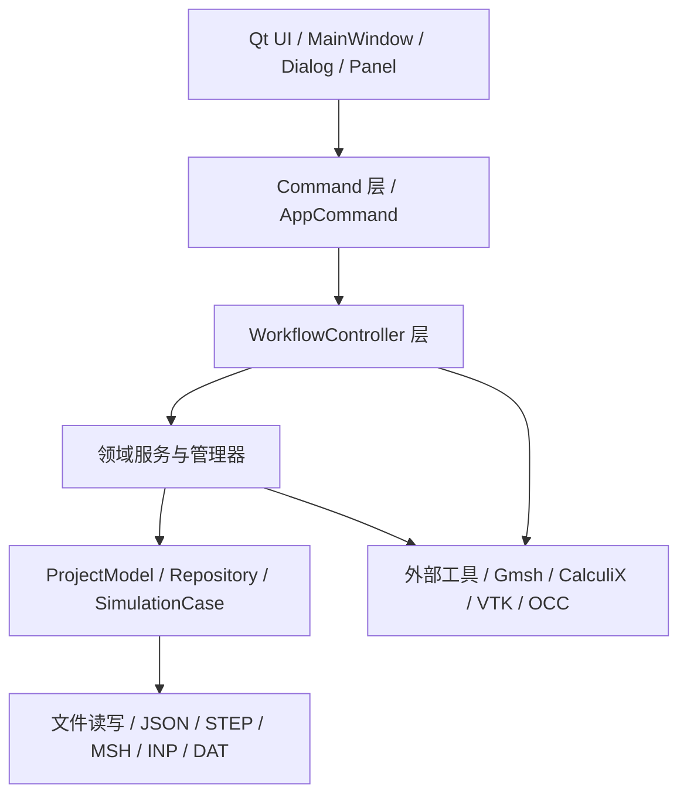

# MyCAE 软件实现方案、架构与关键技术说明

本文档从代码级和架构级说明 MyCAE 当前版本的实现方案、核心功能、关键技术路线和后续扩展方向。内容基于当前源码结构整理，适合作为项目设计说明、阶段汇报和后续开发交接文档。

## 1. 软件定位

MyCAE 是一个基于 Qt 6、VTK、OpenCASCADE、Gmsh、CalculiX 的桌面 CAE 集成软件。当前目标是完成从 CAD 几何创建、面组选择、网格划分、边界条件/载荷定义、求解器导出运行到结果可视化的闭环流程。

当前软件重点支持结构力学仿真流程：

```text
创建/导入几何
-> 拾取几何面并创建 FaceGroup
-> Gmsh 生成四面体网格
-> FaceGroup 映射为 Gmsh PhysicalGroup / MeshBoundary
-> 创建材料、边界条件、载荷
-> 导出 CalculiX 输入文件
-> 运行 ccx.exe
-> 读取结果并在 VTK 中显示云图
```

## 2. 总体架构

软件采用“UI 层 - 命令层 - 工作流层 - 领域服务层 - 数据模型/文件层 - 外部工具层”的分层结构。



这种分层的好处是：

- UI 只负责交互，不直接操作底层文件和求解器。
- Command 负责把菜单/工具栏动作变成可执行任务。
- WorkflowController 负责一个完整业务流程，例如“生成网格”“运行求解”。
- 领域服务负责可复用业务逻辑，例如 FaceGroup 增删改、SimulationCase 读写。
- Repository 保存当前工程内存状态。
- 外部工具封装在独立模块里，避免 Gmsh、CalculiX 逻辑污染 UI。

## 3. 入口与主窗口

程序入口在：

```text
src/main.cpp
```

核心流程：

- 设置 VTK OpenGL 默认格式。
- 创建 `QApplication`。
- 应用全局 UI 风格 `AppStyle::apply(app)`。
- 解析命令行参数，支持样例校验、UI 冒烟测试、截图生成。
- 创建并显示 `MainWindow`。

主窗口在：

```text
src/ui/MainWindow.cpp
src/ui/MainWindow.h
```

`MainWindow` 负责组织整个桌面应用：

- 创建 Dock 面板：工程树、属性面板、日志面板、结果后处理面板、VTK 渲染视图。
- 创建菜单、工具栏、动作注册表。
- 初始化 VTK 渲染器。
- 维护 `ProjectModel`、`GeometryManager`、`PickController`、`SolverPluginManager` 等核心对象。
- 将 UI 事件转换成 `WorkflowCommandContext`，交给命令层执行。

需要注意：VTK 首次渲染被延迟到 `showEvent()` 中执行，避免 Qt 窗口尚未显示时 OpenGL 上下文不完整导致崩溃。

## 4. 命令层设计

命令层位于：

```text
src/commands/
```

核心接口：

```text
src/commands/AppCommand.h
src/commands/WorkflowCommandContext.h
```

每个菜单或工具栏动作都对应一个 `AppCommand`，例如：

- `GeometryCommands.cpp`：创建 Box、Cylinder、布尔操作等。
- `MeshCommands.cpp`：检查 Gmsh、生成网格、读取网格信息、显示网格。
- `SolverCommands.cpp`：创建材料、边界条件、载荷、导出/运行求解器。
- `FaceGroupEditCommands.cpp`：从拾取面创建面组、追加/移除面、局部网格尺寸、物理组开关。

`WorkflowCommandContext` 把命令执行所需的上下文统一注入：

```text
ProjectManager
GeometryManager
ProjectModel
SolverPluginManager
ProjectTreePanel
PropertyPanel
RenderView
LogPanel
QMainWindow
PickController
UndoStackController
```

这种设计避免命令层直接依赖 `MainWindow` 的内部实现，也方便后续扩展自动化测试命令。

## 5. 工程模型与数据仓库

核心工程状态在：

```text
src/project/ProjectModel.h
src/project/ProjectContext.h
```

`ProjectModel` 是运行时内存状态的统一入口，内部包含：

- `GeometryRepository`：几何对象、Box、Cylinder。
- `MeshRepository`：网格对象、网格边界、网格设置。
- `SolverRepository`：材料、边界条件、载荷、FaceGroup。
- `ResultRepository`：求解结果对象。
- `SelectionState`：当前选择状态。

重要设计点：

- UI 不直接保存工程数据，而是通过 `ProjectModel` 修改内存状态。
- 工程保存时，几何、网格、仿真 case、结果分别由对应 Manager 写入磁盘。
- `SimulationCaseBuilder` 从 `ProjectModel` 生成统一的 `SimulationCase`，再写入 `solver/case.json`。

相关文件：

```text
src/solver/SimulationCase.h
src/solver/SimulationCaseBuilder.cpp
src/solver/SimulationCaseJsonReader.cpp
src/solver/SimulationCaseJsonWriter.cpp
src/solver/SimulationCaseManager.cpp
```

## 6. 几何建模实现

几何模块位于：

```text
src/geometry/
src/occ/
```

当前支持：

- Box 几何创建。
- Cylinder 几何创建。
- OpenCASCADE BREP / STEP 输出。
- 基础布尔操作。
- 几何属性展示。
- VTK 中显示 CAD 几何。

关键类：

```text
src/geometry/GeometryCreationController.cpp
src/geometry/GeometryManager.cpp
src/occ/OCCBoxBuilder.cpp
src/occ/OCCCylinderBuilder.cpp
src/occ/OCCShapeIO.cpp
src/occ/OCCShapeConverter.cpp
```

实现方案：

- 用 OpenCASCADE 构造真实 BRep 几何。
- 保存 `.brep` 和 `.step` 文件。
- 用 `GeometryObject` 记录几何元数据。
- 用 `OCCShapeConverter` 将 OCC Shape 转换为 VTK 可显示数据。

## 7. 面拾取与 FaceGroup

面拾取模块是几何和仿真的桥梁。

相关文件：

```text
src/picking/
src/geometry/FaceGroup.h
src/geometry/FaceGroupService.cpp
src/geometry/FaceReferenceUtils.cpp
src/render/RenderHighlightController.cpp
```

核心数据结构是 `FaceGroup`：

```cpp
struct FaceGroup
{
    QString id;
    QString name;
    QString geometryName;
    std::vector<int> faceIndices;
    std::vector<FaceReference> faceReferences;
    bool physicalGroupEnabled = true;
    bool localMeshEnabled = false;
    double localMeshSize = 0.0;
};
```

FaceGroup 解决的问题：

- 用户在几何上选择一个或多个面。
- 这些面用于边界条件和载荷目标。
- 这些面在网格生成时导出为 Gmsh Physical Surface。
- 生成网格后映射成 MeshBoundary，供 CalculiX 表面约束和载荷使用。

当前 FaceGroup 支持：

- 从拾取面创建面组。
- 追加拾取面。
- 移除拾取面。
- 清空面。
- 重命名。
- 删除。
- 物理组开关。
- 局部网格尺寸设置。

## 8. 网格划分实现

网格模块位于：

```text
src/mesh/
src/workflow/MeshWorkflowController.cpp
src/commands/MeshCommands.cpp
src/ui/MeshSetupDialog.cpp
```

当前网格流程：

```text
选择几何对象
-> 打开 MeshSetupDialog
-> 选择单元类型和尺寸控制
-> GmshCaseWriter 生成可选 .geo 文件
-> GmshRunner 调用 gmsh.exe
-> MshReader 读取 .msh
-> MeshBoundaryBuilder 构建 MeshBoundary
-> MeshManager 保存 mesh json
-> VTK 显示网格
```

### 8.1 MeshSetup

网格设置定义在：

```text
src/mesh/MeshSetup.h
```

当前支持：

- `Tet4 - Linear tetrahedron`
- `Tet10 - Quadratic tetrahedron`
- 自动网格尺寸。
- 手动最小尺寸 `minimumSize`。
- 手动最大尺寸 `maximumSize`。

Tet10 生成时会向 Gmsh 传入：

```text
-order 2 -setnumber Mesh.SecondOrderLinear 1
```

其中 `Mesh.SecondOrderLinear=1` 用于降低二阶节点在 CAD 曲面上投影导致负 Jacobian 的风险。

### 8.2 Gmsh 调用

封装在：

```text
src/mesh/GmshRunner.cpp
```

职责：

- 检查 `gmsh.exe` 是否存在。
- 执行 `gmsh --version`。
- 执行三维网格生成。
- 根据 `MeshSetup` 拼接参数：
  - `-3`
  - `-format msh2`
  - `-order 2`
  - `-clmin`
  - `-clmax`

### 8.3 PhysicalGroup 与 MeshBoundary

相关文件：

```text
src/mesh/GmshCaseWriter.cpp
src/mesh/MeshBoundaryBuilder.cpp
src/mesh/MshReader.cpp
```

`GmshCaseWriter` 负责把 FaceGroup 写入 Gmsh `.geo`：

```text
Physical Surface("Box_1.FixedEnd") = {surfaceTag};
```

`MshReader` 读取：

- `$PhysicalNames`
- `$Nodes`
- `$Elements`
- 一阶三角形 `type 2`
- 二阶三角形 `type 9`
- 一阶四面体 `type 4`
- 二阶四面体 `type 11`

`MeshBoundaryBuilder` 根据物理组和表面三角形生成 `MeshBoundary`，用于后续求解器边界映射。

## 9. 材料、边界条件与载荷

相关文件：

```text
src/solver/Material.h
src/solver/BoundaryCondition.h
src/solver/Load.h
src/ui/MaterialDialog.cpp
src/ui/BoundaryConditionDialog.cpp
src/ui/LoadDialog.cpp
src/ui/SolverDataController.cpp
```

当前支持：

- 创建材料。
- 创建边界条件。
- 创建载荷。
- 编辑和删除求解数据。
- 保存到 `solver/case.json`。

近期已优化：

- 创建载荷时，Boundary Condition 不再手动输入 ID，而是从已有边界条件下拉选择。
- 载荷单位不再手动输入，而是按载荷类型提供下拉选项。
- 这样减少了用户输错 ID 或单位字符串导致求解导出失败的风险。

## 10. 求解器插件架构

求解器插件系统位于：

```text
src/solver/plugin/
```

核心接口：

```text
src/solver/plugin/SolverPlugin.h
src/solver/plugin/SolverPluginManager.cpp
src/solver/plugin/SolverPluginDescriptor.h
```

当前注册方式：

```text
src/solver/plugin/BuiltInSolverPluginRegistry.cpp
```

内置插件：

- CalculiX：结构力学求解。
- OpenFOAM：预留。

外部插件：

- External Demo Solver：通过资源目录中的外部进程插件配置加载。

插件能力通过 `SolverCapabilities` 描述，例如：

- export
- run
- read-result

这种设计使求解器与 UI 解耦。UI 只关心插件能力，不直接依赖某个具体求解器。

## 11. CalculiX 集成方案

CalculiX 模块位于：

```text
src/solver/calculix/
```

核心流程：

```text
SolverCaseWorkflowController
-> CalculiXPlugin
-> CalculiXCaseDataBuilder
-> CalculiXInputDeckBuilder
-> CalculiXCaseWriter
-> CalculiXRunner
-> CalculiXResultReader
-> ResultRepository
```

### 11.1 输入数据构建

`CalculiXCaseDataBuilder` 从工程中提取：

- 当前 mesh。
- MeshData。
- MeshBoundary。
- 材料。
- 边界条件。
- 载荷。

并校验：

- mesh 是否存在。
- material 是否有效。
- boundary/load 是否启用。
- mesh 是否有可用四面体单元。

### 11.2 输入文件导出

关键文件：

```text
src/solver/calculix/CalculiXDeckSectionWriter.cpp
src/solver/calculix/CalculiXInputDeckBuilder.cpp
src/solver/calculix/CalculiXLoadWriter.cpp
```

当前支持的实体单元：

- `C3D4`：对应 Tet4。
- `C3D10`：对应 Tet10。

导出的主要段：

```text
*NODE
*NSET, NSET=NALL
*ELEMENT, TYPE=C3D4 或 C3D10
*MATERIAL
*ELASTIC
*SOLID SECTION
*NSET
*ELSET
*SURFACE
*BOUNDARY
*STEP
*STATIC
*DLOAD
*NODE FILE
*EL FILE
```

### 11.3 边界映射

关键文件：

```text
src/solver/calculix/CalculiXBoundaryMapper.cpp
src/solver/calculix/CalculiXSurfaceMapper.cpp
src/solver/calculix/CalculiXMeshBoundaryResolver.cpp
```

映射流程：

```text
BoundaryCondition
-> FaceGroup / MeshBoundary
-> physicalTag
-> surface triangle nodes
-> tetrahedral element face
-> CalculiX *SURFACE
```

Tet10 支持点：

- 表面节点集包含二阶三角形的中边节点。
- 单元面映射仍使用四面体角点确定所在单元面。
- C3D10 导出时对 Gmsh 节点顺序做 CalculiX 兼容处理。

### 11.4 运行与结果读取

运行封装：

```text
src/solver/calculix/CalculiXRunner.cpp
src/solver/calculix/CalculiXEnvironment.cpp
```

CalculiX 可执行文件路径优先级：

```text
环境变量 MYCAE_CALCULIX_EXECUTABLE
-> CMake 缓存 MYCAE_CALCULIX_EXECUTABLE
-> 默认 ccx
```

结果读取：

```text
src/solver/calculix/CalculiXDatResultReader.cpp
src/solver/calculix/CalculiXResultReader.cpp
src/solver/calculix/CalculiXResultGridBuilder.cpp
```

支持读取：

- 位移 Ux / Uy / Uz。
- 位移模量。
- Von Mises 应力。

## 12. 结果后处理与可视化

结果模块位于：

```text
src/result/
src/ui/ResultPostprocessPanel.cpp
src/ui/MainWindowResultController.cpp
src/ui/VtkRenderCanvas.cpp
```

当前功能：

- 显示位移云图。
- 显示 Von Mises 应力云图。
- 调整变形比例。
- 显示/隐藏网格边。
- 显示未变形轮廓。
- 锁定标量范围。
- 点选探针。
- 导出 CSV。
- 导出报告。
- 导出截图。
- 结果动画。

VTK 显示支持：

- Tet4：`vtkTetra`
- Tet10：`vtkQuadraticTetra`

## 13. 当前主要功能点清单

### 工程管理

- 新建工程。
- 打开工程。
- 最近工程列表。
- 工程资源查看。
- 保存 `solver/case.json`。
- 恢复已有几何、网格、求解结果。

### 几何

- 创建 Box。
- 创建 Cylinder。
- 保存 BREP。
- 保存 STEP。
- 显示几何。
- 基础布尔操作。

### 拾取与面组

- 面拾取模式。
- 创建 FaceGroup。
- 面组高亮。
- 面组重命名、删除、清空。
- 面组物理组开关。
- 面组局部网格尺寸。

### 网格

- 检查 Gmsh。
- 生成 Tet4 网格。
- 生成 Tet10 网格。
- 自动尺寸。
- 最小/最大尺寸控制。
- PhysicalGroup 导出。
- MeshBoundary 构建。
- 网格显示。
- 网格信息读取。

### 仿真数据

- 材料创建、编辑、删除。
- 边界条件创建、编辑、删除。
- 载荷创建、编辑、删除。
- 载荷与边界条件下拉绑定。
- 载荷单位下拉选择。

### 求解

- CalculiX 输入文件导出。
- CalculiX 运行。
- CalculiX 结果读取。
- 外部 Demo Solver 插件加载。
- OpenFOAM 插件预留。

### 后处理

- 位移云图。
- 应力云图。
- 变形显示。
- 网格边显示。
- 探针查询。
- 截图、CSV、报告导出。

## 14. 关键技术总结

### Qt 6

用于桌面 UI、菜单、工具栏、弹窗、Dock 面板、工程树、属性面板和信号槽通信。

### VTK

用于 CAD 几何、网格和结果云图显示。当前使用 `vtkUnstructuredGrid` 表示体网格，使用 `vtkTetra` 和 `vtkQuadraticTetra` 支持 Tet4/Tet10。

### OpenCASCADE

用于创建真实 CAD 几何、保存 BREP/STEP、支持后续几何布尔和拓扑面选择。

### Gmsh

用于将 STEP/OCC 几何生成三维四面体网格，并通过 `.geo` 文件导出 Physical Surface 和局部尺寸控制。

### CalculiX

用于结构力学有限元求解。MyCAE 负责生成 `.inp`，调用 `ccx.exe`，读取 `.dat/.frd/.sta/.log` 等结果文件。

### JSON 工程数据

使用 `solver/case.json` 保存材料、边界条件、载荷、面组和网格设置，保证工程可恢复。

### 插件化求解器

通过 `SolverPlugin` 接口隔离求解器，实现内置插件和外部进程插件统一管理。

## 15. 当前限制与风险

当前版本已经能跑通基础结构仿真流程，但仍有一些限制：

- 同一几何体当前只保留一个网格对象，重新生成会覆盖旧网格。
- Hex8/Hex20 六面体网格暂未支持。
- OpenFOAM 插件目前是 reserved 状态。
- CalculiX 材料暂时默认将第一个材料赋给全部单元。
- 复杂几何的 OCC face index 到 Gmsh surface tag 映射仍依赖当前 STEP/OCC 顺序，后续应做更稳健的几何匹配。
- Tet10 虽已接入，但不同几何和 Gmsh 参数下仍需要更多质量校验。
- 当前网格质量报告主要依赖 Gmsh stdout，没有单独形成结构化质量数据。

## 16. 后续优化建议

优先建议：

1. 增加网格质量报告。
   - 最小质量。
   - 平均质量。
   - 低质量单元数量。
   - 是否存在负体积或异常单元。

2. 支持同一几何体多个网格版本。
   - `Box_1_Mesh_Coarse`
   - `Box_1_Mesh_Fine`
   - `Box_1_Mesh_Tet10`

3. 增强 Tet10 验证。
   - 导出前检查 C3D10 节点顺序。
   - 导出前做单元体积/Jacobian 基础检查。
   - 失败时给用户明确建议。

4. 支持 Hex8。
   - 需要引入结构化/扫掠/重组网格流程。
   - 不建议直接对任意 STEP 开放 Hex。

5. 完善材料分区。
   - 支持不同几何体或不同 Physical Volume 指定不同材料。

6. 完善 OpenFOAM。
   - 当前架构已经预留插件入口，可逐步补 case 导出、运行和结果读取。

## 17. 总结

MyCAE 当前已经形成了完整的 CAE 软件骨架：

```text
Qt UI
-> Command
-> Workflow
-> ProjectModel
-> Geometry / Mesh / Solver / Result
-> Gmsh + CalculiX + VTK
```

它的核心价值在于把 CAD 几何、网格划分、求解器输入输出和结果可视化连接成统一工程流程。当前版本已经完成结构力学方向的基础闭环，并开始支持更高阶的 Tet10/C3D10 单元。后续重点应放在网格质量、多个网格版本、材料分区和更多求解器能力扩展上。
